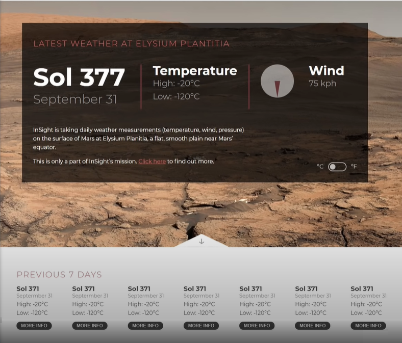

# Mars-Weather-App
 Mars weather app for YT collab by Kevin Powell and Web Dev Simplified. The App was built using HTML, SCSS and JavaScript for studying purpose. The data is fetched from NASA's Mars Weather Service API.

  

